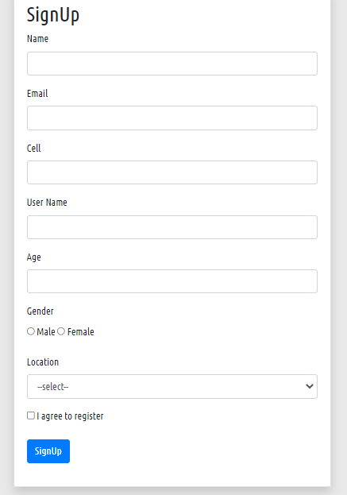

## Form Validation
This is the form validation system. We will upload all validation system step by step

#### Our project features--
--get  data from all input fiend
--email validate by filter
--fixed email check
--get all notification for every field in array.
--create different function for difrent condition

''' php
	<?php 
		
		if (isset($_POST['add'])) {
			$name= $_POST['name'];
			$email= $_POST['email'];
			$cell= $_POST['cell'];
			$uname= $_POST['uname'];
			$age= $_POST['age'];
			$agree="";
			if (isset($_POST['agree'])) {
				$agree=$_POST['agree'];
			}
			$gender="";
			if (isset($_POST['gender'])) {
				$gender=$_POST['gender'];
			}

			 $location= $_POST['location'];
			

			

			$status = true;

			if (empty($name) || empty($email) || empty($cell) || empty($uname) || empty($age) ||empty($gender) || empty($location)) {
				$mgs[]= validate('All fields are require!', 'danger');
				$status=false;
			}
			if (emailCheck($email)==false) {
				$mgs[]= validate('Invalid Email', 'warning');
				$status=false;
			}
			if (fixedemail($email, ['jnu.ac.bd', 'nsu.ac.bd', 'ist.ed.bd'])==false) {
				$mgs[]= validate('This email is not our email', 'warning');
				$status=false;
			}
			 if ($age<20) {
				$mgs[] = validate('You are not in right age', 'warning');
				$status=false;
			}
			if ( $location!='Rampura' && $location!='Badda' && $location!='Uttara' && $location!='Malibagh' && $location!='Mirpur') {
				$mgs[]=validate('select a location', 'warning');
				$status= false;
			}
			if ($gender!='Male' && $gender!='Female') {
				$mgs[]=validate('select a gender', 'warning');
				$status= false;
			}
			if ($agree!='agree') {
				$mgs[]= validate('you should agree first', 'warning');
				$status=false;
			}
			if($status==true) {
				$mgs[]= validate('Data stable!' , 'success');
				cleardata();
			}
		}
        ?> '''

        '''php function
        <?php

/**
 * message validation
 */

function validate($mgs, $type){
    return "
{$mgs}<button class=\"close\" data-dismiss=\"alert\">&times;</button>
";
}

/**
 * email validation
 */

 function emailCheck($email){
     if (filter_var($email, FILTER_VALIDATE_EMAIL)) {
         return true;
     }else{
         return false;
     }

 }

 /**
  * fixed email validation
  */

  function fixedemail(string $email, array $mail){

    $eamil_err= explode('@', $email);
    $last = end($eamil_err);

    if (in_array($last, $mail)) {
        return true;
    } else {
        return false;
    }
    

  }

  /**
   * old data manage
   */

   function old($name){

    if (isset($_POST[$name])) {
        echo $_POST[$name];
    } else {
        echo "";
    }
    

   }

   /**
    * data clear
    */
    function cleardata(){
        $_POST = "";
    }

?>
'''
